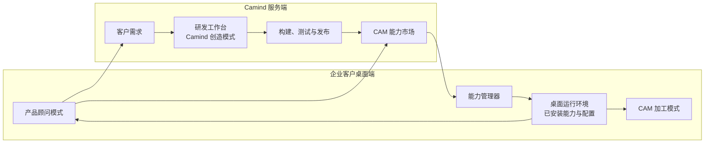
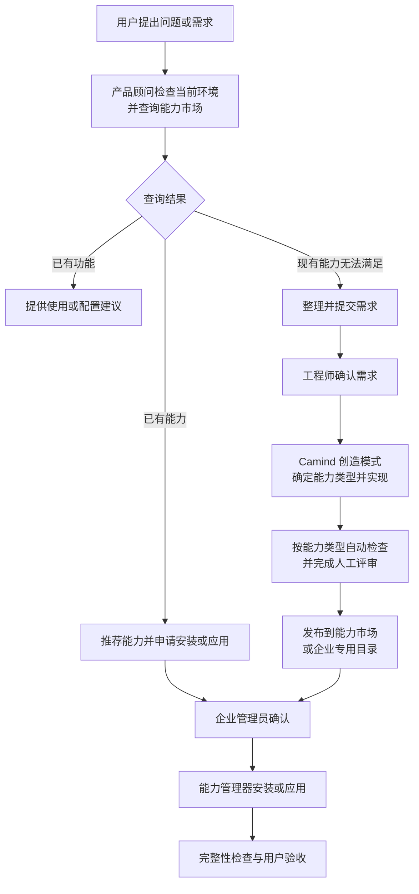

# CAM 能力市场与产品顾问设计

> 状态：目标设计；当前已实现 CAM 加工模式，其余为本文设计内容

## 1. 目标

Camind 保持统一的桌面应用，通过可组合的能力满足不同企业的业务需求。通用能力可供多家企业使用，企业专用能力只对指定企业开放。

用户用自然语言描述问题或需求。系统先查找已有功能和市场能力；现有能力无法满足时，将需求提交给 Camind 服务端，由工程师确定采用插件、Agent 模式、Skill、知识包、配置或模板，并完成交付。

## 2. 系统组成

系统分为两个端侧：

| 端侧 | 职责 | Agent 模式 |
| --- | --- | --- |
| 企业客户桌面端 | 完成 CAM 业务，处理产品问题和新增需求，使用企业获准的能力 | CAM 加工模式、产品顾问模式 |
| Camind 服务端 | 管理客户需求、能力市场、能力开发、测试、发布和企业授权 | Camind 创造模式 |

工程师通过服务端的研发工作台使用 Camind 创造模式。



## 3. Agent 模式

### 3.1 CAM 加工模式

负责读件、工艺规划、NX 执行、检查和交付。

### 3.2 产品顾问模式

统一处理使用问题、配置问题、软件缺陷和新增需求：

1. 理解用户的问题和目标；
2. 查看当前版本、配置和已安装能力；
3. 查询 CAM 能力市场；
4. 已有功能时提供使用或配置建议；
5. 有合适能力时说明类型、功能、兼容性和所需权限，并申请安装或应用；
6. 现有能力无法满足时整理需求、验收条件和必要的脱敏诊断信息，提交服务端；
7. 向用户同步处理进度并组织验收。

用户在 CAM 加工过程中提出反馈时，系统创建产品顾问会话，并携带原会话、任务、错误结果和版本信息。

### 3.3 Camind 创造模式

基于 DeepSeek Harness 创造模式，增加 Camind 项目规范、能力模板、市场查询和测试工具，供工程师设计和开发能力：

1. 读取客户需求和验收条件；
2. 查询市场中的相似能力；
3. 检查现有 DeepSeek Harness 服务和插件接口；
4. 判断采用插件、AgentPreset、Skill、知识包、配置或模板；
5. 创建并验证原型；
6. 生成候选内容、代码和测试；
7. 提交自动检查和人工评审。

## 4. CAM 能力市场

能力市场集中提供可安装、可更新、可授权的 CAM 能力：

| 能力类型 | 作用 | 示例 |
| --- | --- | --- |
| 插件 | 增加工具、服务、页面或外部系统连接 | MES 连接器、刀具同步、报价工具 |
| Agent 模式（AgentPreset） | 提供一套完整的 Agent 能力组合 | 报价模式、审图模式、质量审核模式 |
| Skill | 规定 Agent 的操作步骤和业务规则 | 铝件加工规程、首件检查规程 |
| 通用知识包 | 提供经过审核的行业知识 | 材料知识、刀具知识、加工缺陷处理 |
| 配置与模板 | 适配企业参数和输出格式 | 加工设定单模板、字段映射、审批配置 |

每项能力记录：

- 类型、名称、说明和版本；
- 支持的 Camind 和 DeepSeek Harness 版本，以及适用时的 NX 和操作系统版本；
- 依赖能力和配置要求；
- 来源、适用企业和授权状态；
- 测试结果、更新说明和回滚版本；
- 构建产物的签名和哈希。

不同类型采用对应的检查方式：插件检查代码、权限和依赖；AgentPreset 检查组合；Skill 检查步骤和工具引用；知识包检查来源和适用范围；配置与模板检查格式和字段。

市场中的能力分为通用能力和企业专用能力。企业差异优先放入配置或独立适配器，通用逻辑保留在共享能力中。

通用知识包由市场统一发布和更新；企业工艺诀窍、历史零件经验和客户规范保存在企业本地知识库中：

```text
企业本地知识库
├─ 市场安装的通用知识包
└─ 企业自己的知识与经验
```

## 5. 需求与能力交付流程



能力开发以多企业复用为优先。企业字段、审批规则和系统地址进入配置；企业接口差异进入适配器。

## 6. 使用场景

### 6.1 现有功能指导

用户说：“加工完成后在哪里下载 NC 程序？”

产品顾问查看当前版本和已安装能力，给出操作步骤并引导用户打开对应交付物。

### 6.2 推荐市场能力

用户说：“我们希望加工完成后自动把程序上传到 MES。”

产品顾问查询能力市场，找到适配该企业 MES 的连接器插件，说明类型、功能、版本要求和权限。企业管理员确认后，能力管理器完成安装和完整性检查。

### 6.3 提交新需求

用户说：“机床刀位经常变化，希望开工前从刀具管理系统同步当前刀位、刀具寿命和可用状态，再自动检查缺刀。”

产品顾问确认机床、刀具数据来源、检查时点和处理要求。现有能力无法满足时，产品顾问提交需求，工程师决定升级现有刀具校验能力或开发刀具管理系统连接器。

连接器读取机床当前刀位、刀具规格、寿命和可用状态，在现有刀库校验基础上与工艺计划逐项核对，输出缺刀和冲突清单。通用检查逻辑由多家企业共用，不同刀具管理系统的接口和字段放入适配器与企业配置。

## 7. 职责边界

| Agent 负责 | 软件服务负责 |
| --- | --- |
| 理解问题和需求 | 企业身份和能力授权 |
| 查询市场并提出建议 | 版本与依赖检查 |
| 整理需求和验收条件 | 构建、自动测试和签名校验 |
| 创建 AgentPreset、Skill、知识内容和插件代码 | 能力下载、安装、同步和完整性检查 |
| 分析测试结果并协助修复 | 版本切换、回滚和操作记录 |

能力发布由工程师审批，能力安装或应用由企业管理员确认。
